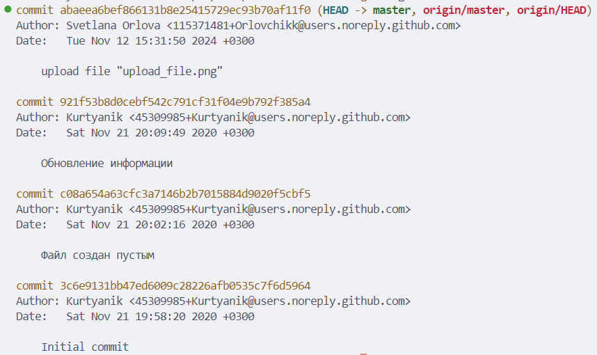
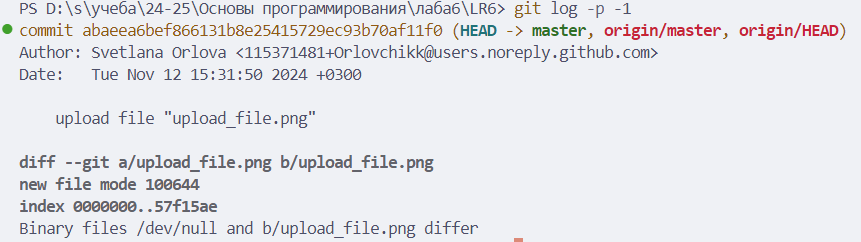
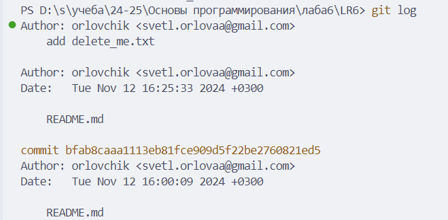
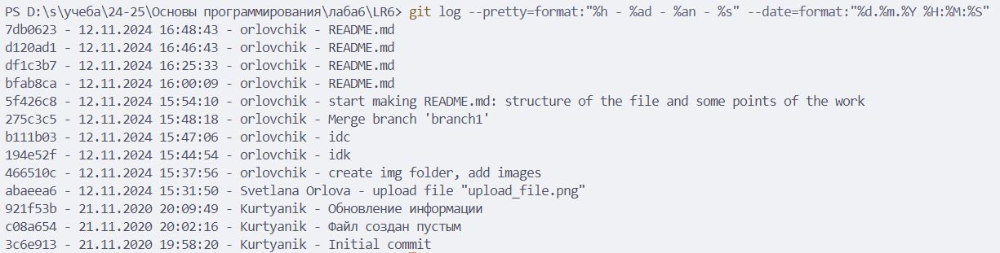

# Лабораторная работа №6: Система контроля версий

**Студент:** Орлова Светлана Николаевна

**Группа:** 4319

## Описание работы

Цель лабораторной работы: изучение базовых возможностей системы управления версиями, опыт работы с Git Api, опыт работы с локальным и удаленным репозиторием.

## Содержание

1. [Форк репозитория LR6](#форк-репозитория-lr6)
2. [Установка Git](#установка-git)
3. [Клонирование репозитория](#клонирование-репозитория)
4. [Добавление файла в GitHub и подтягивание изменений](#добавление-файла-в-github-и-подтягивание-изменений)
5. [История операций для каждой из веток](#история-операций-для-каждой-из-веток)
6. [Просмотр последних изменений](#просмотр-последних-изменений)
7. [Слияние веток и разрешение конфликтов](#слияние-веток-и-разрешение-конфликтов)
8. [Удаление побочной ветки](#удаление-побочной-ветки)
9. [Откат коммита](#откат-коммита)
10. [Создание ветки для отчёта](#создание-ветки-для-отчёта)
11. [История операций в отчёте](#история-операций-в-отчёте)
12. [Выводы](#выводы)

## Форк репозитория LR6

1. Переходим на страницу репозитория [LR6](https://github.com/Kurtyanik/LR6)

2. Нажимаем кнопку "Fork" в правом верхнем углу страницы.

## Установка Git

1. Скачиваем установщик Git с [официального сайта](https://git-scm.com/).

2. Запускаем установщик и следуем инструкциям.

3. Настраиваем имя пользователя и email:

    ```bash
    git config --global user.name "orlovchik"
    git config --global user.email svetl.orlovaa@gmail.com
    ```

## Клонирование репозитория

1. Клонируем репозиторий на локальную машину:

    ```bash
    git clone https://github.com/orlovchik/LR6.git
    ```

## Добавление файла в GitHub и подтягивание изменений

1. Нажатием кнопки "Add file" -> "Upload files" добавляем [Загрузка файлов](img/upload_file.png) в репозиторий.

2. Подтягиваем изменения на локальную машину:

    ```bash
    git pull
    ```

## История операций для каждой из веток

1. Получить историю коммитов для всех веток можно с помощью команды:

    ```bash
    git log --all
    ```

    

## Просмотр последних изменений

1. Для просмотра изменений последнего коммита используется команда:

    ```bash
    git log -p -1
    ```

    

## Слияние веток и разрешение конфликтов

1. Для создания ветки `branch1` использовалась команда:

    ```bash
    git branch -b branch1
    ```

2. На ветке `branch1` были сделаны некоторые изменения, после чего прописана следующие команды:

    ```bash
    git add .
    git commit -m 'idk'
    ```

3. Переключение на ветку `master`:

    ```bash
    git checkout master
    ```

4. Слияние веток `master` и `branch1`:

    ```bash
    git merge branch1
    ```

5. Разрешила конфликт в файле [README.md](README.md) при помощи "Merge Resolve" в VSCode (приняла версию из ветки `branch1`).

    

## Удаление побочной ветки

1. Перейдем на ветку `master`:

    ```bash
    git checkout master
    ```

2. Удаление локальной ветки:

    ```bash
    git branch -d branch1
    ```

    [Удаление ветки `branch1`](img/delete_branch.png)

## Откат коммита

1. Получение истории коммитов:

    ```bash
    git log --oneline
    ```

    

2. Откат коммита:

    ```bash
    git reset --hard df1c3b732cf58bf63bc47beec39f8f122e8311ec
    ```

## Создание ветки для отчёта

1. Создание новой ветки `final` и переключение на нее:

    ```bash
    git checkout -b final
    ```

## История операций в отчёте

1. Получение истории коммитов в форматированном виде:

    ```bash
    git log --pretty=format:"%h - %ad - %an - %s" --date=format:"%d.%m.%Y %H:%M:%S"
    ```



## Выводы

В ходе выполнения лабораторной работы №6 освоены основные команды Git и приобретены навыки работы с удалёнными репозиториями на GitHub. Изучены комманды fork, clone, commit, merge, reset.
